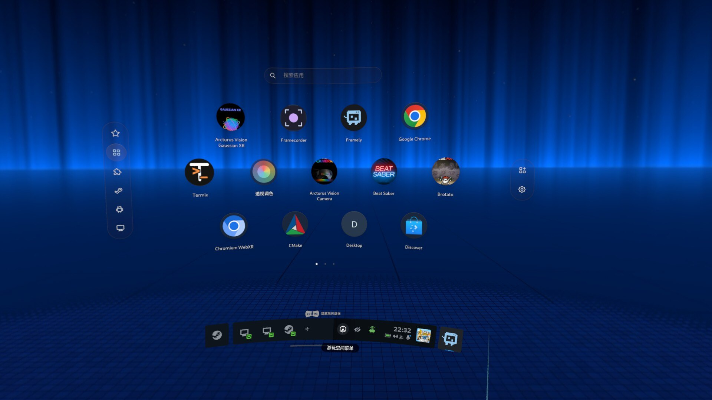
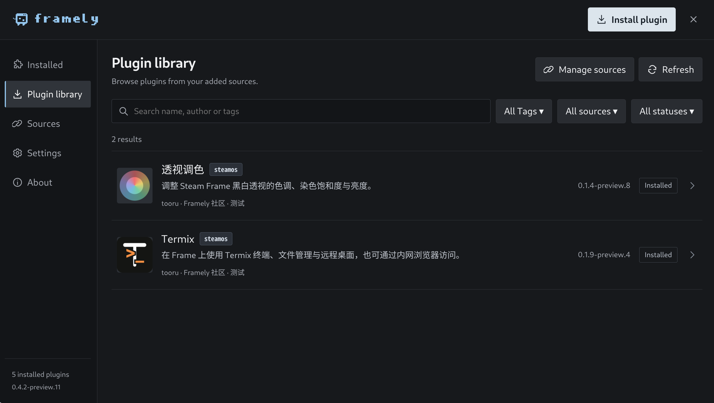

# Framely

<picture>
  <source media="(prefers-color-scheme: dark)" srcset="assets/branding/framely-logo-light.svg">
  
</picture>

[English](README.md)

> Framely 目前仍在快速迭代中，Preview 版本可能频繁更新，功能与交互仍在持续完善。

Steam Frame 的 React 插件管理器：Rust 核心服务、独立 CEF/OpenVR 宿主、网络管理面板和电脑端安装器。可管理插件、来源、窗口、通知和更新。





## 安装

目标设备为 Linux ARM64 Steam Frame。先在 Frame 上启用开发者模式与 SSH，确保电脑和 Frame 在同一网络，并准备好 `steamos` 账户密码。

### 安装器安装

从 [Framely Installer 发行下载页](https://github.com/SteamFramelyHomebrew/framely/releases/tag/installer-v0.4.1-preview.9) 下载适合电脑平台的安装器。Linux 提供 `.tar.gz`，Windows 和 macOS 提供 `.zip`。解压并启动安装器，填写 Frame 的 IP 和 SSH 端口，核对 SSH 指纹后使用 `steamos` 账户连接。选择 Framely 版本，再确认安装。安装 Preview 版本时需启用测试版本；安装器与 Frame 本体的版本号相互独立。

### 命令安装

**在 Frame 的 SSH 终端中**执行以下命令，安装最新正式版：

```bash
curl -fsSL https://raw.githubusercontent.com/SteamFramelyHomebrew/framely/main/install.sh | bash -s -- install
```

安装 Preview 时指定实际已发布的标签：

```bash
curl -fsSL https://raw.githubusercontent.com/SteamFramelyHomebrew/framely/main/install.sh | bash -s -- install --version v0.4.3-preview.5
```

将示例标签替换为需要安装的已发布版本，并在提示时输入 sudo 密码。更新、修复和卸载步骤见[安装指南](docs/zh-CN/user-guide/installation.md)。

首次安装使用包含 CEF 的完整离线包，更新使用不含 CEF 的本体包并复用运行库；同时提供独立 CEF 在线下载。设备无需 Node.js 或 Rust。安装会请求 sudo；不会自动解除 SteamOS 只读保护。在 SteamVR Dashboard 中指向 Framely Dock 图标，按主扳机打开启动台，按上扳机打开快捷面板；点击启动台右侧的设置按钮打开管理面板。可在“启动台”设置中互换扳机行为。

网络面板默认端口 `15915`，手机/电脑访问 `http://设备IP:15915`。未配置密码时首次访问必须设置并确认密码，保存后登录。设备密码与面板密码相互独立。

## 文档

从 [文档首页](docs/zh-CN/README.md) 开始：

- [安装、更新、修复、回滚与卸载](docs/zh-CN/user-guide/installation.md)
- [基本使用](docs/zh-CN/user-guide/basic-usage.md) · [插件安装与管理](docs/zh-CN/user-guide/plugins.md)
- [网络管理面板](docs/zh-CN/user-guide/network-panel.md)
- [插件开发到发布完整流程](docs/zh-CN/developer-guide/README.md) · [发布插件和插件源](docs/zh-CN/developer-guide/publishing.md)
- [SDK API](docs/zh-CN/developer-guide/sdk.md) · [Manifest 配置](docs/zh-CN/developer-guide/manifest.md) · [生命周期](docs/zh-CN/plugin-lifecycle.md)
- [插件模板](templates/plugin/README.zh-CN.md) · [功能展示示例](examples/showcase/README.zh-CN.md)
- [本体发行维护](docs/zh-CN/releases.md) · [安装器构建](installer/README.zh-CN.md)

## 创建插件

开发机准备 Node.js 22 和 npm，克隆本仓库后执行：

```bash
node tools/plugin-dev.mjs init ../my-plugin yourname.my-plugin
cd ../my-plugin
npm install
npm run dev
npm run build
```

生成项目包含 React 页面、Python 后端、数据保存、生命周期回调、SDK 和构建工具。浏览器预览不启动后端；打包与实际 Frame 测试见开发指南。

## 构建与验证

本体源码在 Linux 构建，需要 Rust、Node.js、C/C++ 和 OpenGL/X11 开发库，生产原生宿主使用锁定版本的 Linux ARM64 CEF。

```bash
npm ci
npm run typecheck
npm run build
cargo test --locked
bash tools/test-native.sh
python3 -m unittest discover -s tests -p 'test_*.py'
```

CEF 构建、集成测试和发布命令见[发行维护](docs/zh-CN/releases.md)。插件支持 `steamos` 和 `root`；哈希校验不代表安全审核，应核对来源和运行用户。

## 许可证

Framely 原创代码，包括本体、安装器、SDK、模板和仓库示例，采用 **AGPL-3.0-only**，全文见 [LICENSE](LICENSE)。第三方依赖和 vendored 文件保留各自许可证。

AGPL 允许商业使用；分发需按许可提供完整对应源码，修改后通过网络与用户交互还须向这些用户提供源码。发行源码对应本仓库的 `v<版本>` 或 `installer-v<版本>` 标签；重新分发者须提供与自己二进制匹配的修改和构建脚本。
